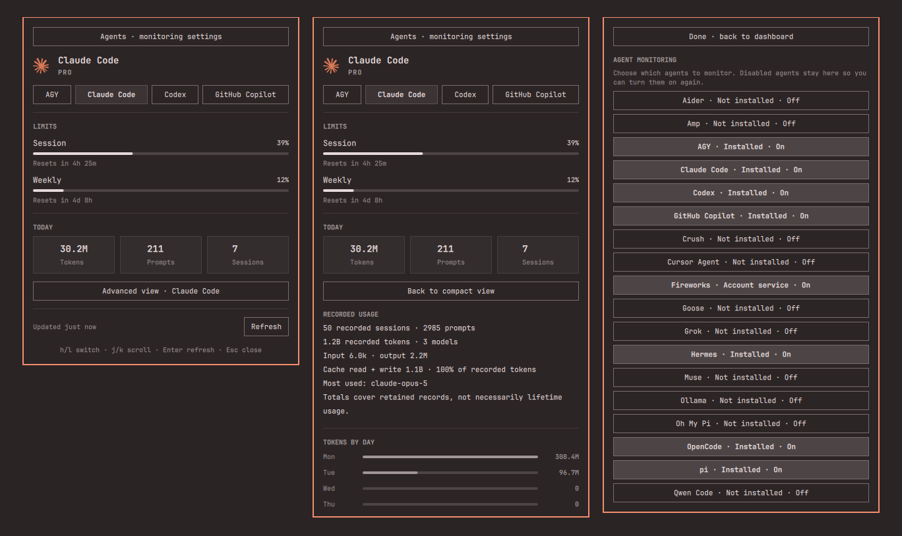

# Agent Monitor

An Omarchy Quattro bar widget for your AI coding agents. It shows subscription limits, daily activity, and model usage in one panel. It covers Claude Code, Codex, OpenCode, Hermes, pi, Oh My Pi, OpenRouter, Fireworks, and more.

It builds on Omarchy's built-in Agents panel and adds installed-agent discovery, local usage for more agents, per-agent monitoring toggles, and an advanced view.



## Features

- Subscription tier and rolling limit windows with reset countdowns for Claude Code and Codex, from Omarchy's own `omarchy agent usage update`.
- Local usage for OpenCode, Hermes, pi, and Oh My Pi: prompts, sessions, today's tokens, and a 7-day activity chart.
- Model breakdown: input, output, cache-read, and cache-write tokens per model.
- OpenRouter credit balance (remaining, funded, spent), using an API key you provide.
- Detects which agents are installed, including mise launcher shims that aren't installed yet.
- Turn monitoring on or off per agent from the panel.

## Requirements

- Omarchy Quattro with its Quickshell shell.
- Python 3 (standard library only).
- Optional: an OpenRouter API key for credit balance.

The plugin runs no background service and sends no telemetry. It makes network requests only to OpenRouter, and only when you've enabled that provider and supplied a key. Claude Code and Codex limits come from Omarchy's own usage command.

## Install

```sh
omarchy plugin add https://github.com/RohiRIK/omarchy-agent-monitor.git --enable
```

Plugin ID: `rohirik.agent-monitor`. To enable an already installed copy:

```sh
omarchy plugin enable rohirik.agent-monitor right
```

If you also use the built-in Agents widget, you can disable it to avoid two agent icons:

```sh
omarchy plugin disable omarchy.agents
```

## Use

Click the agent icon in the bar. Switch between providers at the top of the panel. Open the advanced view for the model breakdown, and open agent settings to turn monitoring on or off for each agent. Data refreshes every `refreshIntervalSec` (default 900 seconds). The refresh button forces an update.

## Configuration

To change the refresh interval, set it on the widget's entry in `~/.config/omarchy/shell.json`:

```json
{ "id": "rohirik.agent-monitor", "refreshIntervalSec": 600 }
```

Per-agent settings are stored in `~/.config/omarchy/agent-monitor/providers.json`, which the panel creates when you first toggle an agent. To show OpenRouter credits, add your key there:

```json
{ "openrouter": { "enabled": true, "apiKey": "sk-or-..." } }
```

You can also set `OPENROUTER_API_KEY` in the shell's environment instead. Keep this file private, because it can contain an API key.

## How it works

`collector.py` ships with the plugin and writes one JSON record per agent to `~/.local/state/omarchy/agent-monitor/usage/`. The panel watches that directory. The collector only reads agent data:

- **Claude Code, Codex, Fireworks:** it calls `omarchy agent usage update` and copies the result.
- **OpenCode, Hermes:** it opens their SQLite databases read-only.
- **pi, Oh My Pi:** it reads their session `.jsonl` logs.
- **OpenRouter:** it calls `GET https://openrouter.ai/api/v1/auth/key` with your key.

Local token counts come from each tool's own logs and can overlap with your subscription totals.

## Remove

```sh
omarchy plugin remove rohirik.agent-monitor
rm -rf ~/.local/state/omarchy/agent-monitor ~/.config/omarchy/agent-monitor
```

The plugin writes nothing else to your system.

## License

MIT. Derived from Omarchy's built-in `omarchy.agents` plugin. Provider logos belong to their owners; see [LICENSE](LICENSE).
